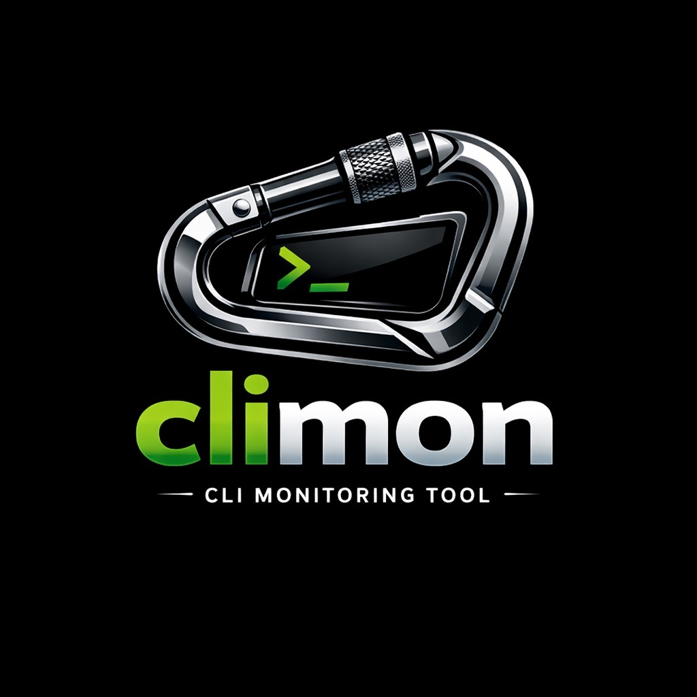

<div align="center">



# climon

**A web dashboard for your interactive CLI sessions — reachable from your phone.**

Prefix any command with `climon` to run it inside a managed pseudo-terminal, then
watch, interact with, and get notified about all of your sessions from one
dashboard — locally, or securely from your phone over an authenticated dev tunnel.

[](LICENSE)
[](https://github.com/jackgeek/climon/releases/latest)


</div>

---

## Why climon?

You run long builds, dev servers, REPLs, and coding agent CLIs across a sprawl of
terminal tabs and VS Code windows. Terminals are easy to lose track of — and when
one is waiting on your input, *you* become the bottleneck, hunting for the tab
that needs attention (coding agents make this worse, stopping to ask questions
whenever they need a decision). climon runs each command inside its own
pseudo-terminal and surfaces them all in one browser dashboard: a **prioritized
list** of your sessions that bumps the ones needing attention to the top and
**notifies you** when they do. So you can:

- **check on and drive your sessions from your phone**, with push notifications
  when one needs attention — see [Work from your phone](#work-from-your-phone-tunnel-link--pwa).
- see at a glance which session is waiting on you, and
- review the final output after a command finishes.

## Features

- **Every session in one place.** Launch a command with `climon` and it shows up
  in a single browser dashboard alongside all your others — no more hunting
  through terminal tabs and VS Code windows.
- **Know instantly which one needs you.** Sessions that stall waiting for input
  are automatically bumped to the top of the list, so the one blocking on your
  decision is always front and centre — not buried three tabs deep.
- **Get notified, don't babysit.** Kick off a long build or a coding agent, walk
  away, and let climon ping you when a session needs attention or finishes.
- **Drive sessions from the browser.** Each session is a fully interactive
  terminal in the dashboard — type, run commands, and answer prompts without
  switching back to the original window.
- **Work from your phone.** Securely reach your dashboard from anywhere over an
  authenticated tunnel, install it as an app on your home screen, and get **push
  notifications when a session needs you** — even with the app closed. The tunnel
  is private to your account and can't be shared. See
  [Work from your phone](#work-from-your-phone-tunnel-link--pwa).
- **Nothing gets lost.** Sessions keep running even if the dashboard restarts,
  and finished commands keep their full output so you can scroll back and review
  what happened.
- **Make it yours.** Pick a terminal theme and tweak your preferences once — they
  follow you across every browser and device.
- **Reach across machines (experimental).** Surface sessions from a remote devbox
  over a secure tunnel, or bridge Windows and WSL on the same machine. See
  [Remote sessions](#remote-sessions).
- **Single, self-contained install.** One command installs climon — no runtime,
  package manager, or `node_modules` to manage. (Remote tunnels are the one
  add-on: they use the Microsoft
  [`devtunnel`](https://learn.microsoft.com/azure/developer/dev-tunnels/) CLI.)

## Install

**Linux / macOS**

```sh
curl -fsSL https://raw.githubusercontent.com/jackgeek/climon/main/install.sh | sh
```

**Windows (PowerShell)**

```powershell
irm https://raw.githubusercontent.com/jackgeek/climon/main/install.ps1 | iex
```

Prefer to install by hand? Download the archive for your platform from the
[latest release](https://github.com/jackgeek/climon/releases/latest)
(`climon-<platform>.zip`), unzip it, and run the bundled dedicated installer
`install` (`install.exe` on Windows). The install scripts still behave the same;
they just download and run that installer for you. See [Build from source](#build-from-source)
to build the binaries yourself.

> climon's release binaries aren't code-signed or notarized yet. The install
> scripts clear the OS "downloaded from the internet" mark (macOS quarantine /
> Windows Zone.Identifier) so climon launches without a Gatekeeper or SmartScreen
> prompt — if you install by hand you may need to clear it yourself. You can read
> the scripts before running them: [`install.sh`](install.sh) /
> [`install.ps1`](install.ps1). Later `climon update` downloads are still verified
> against climon's embedded Ed25519 signing key.

> [!IMPORTANT]
> **Antivirus / malware tools may block climon.** Because the release binaries
> aren't code-signed yet, some antivirus, EDR, or SmartScreen tools may quarantine
> or block them. I'm actively working on getting the executables signed to stop
> this from happening. In the meantime, if your security software blocks climon,
> you may need to add exceptions for these installed files:
>
> - `climon` (`climon.exe` on Windows) — the CLI client / stable stub
> - `climon-server` (`climon-server.exe` on Windows) — the dashboard server /
>   stable stub
> - On Windows, the versioned payloads in the same directory, such as
>   `climon-<version>.dll` and `climon-server-<version>.exe`
>
> They are installed to:
>
> - **Linux / macOS:** `~/.local/bin`
> - **Windows:** `%LOCALAPPDATA%\Programs\climon` (e.g.
>   `C:\Users\<you>\AppData\Local\Programs\climon`)

### Optional: the `devtunnel` CLI

The dev tunnel features — **Tunnel Link** and **Remote sessions over a dev
tunnel** — need Microsoft's [`devtunnel`](https://learn.microsoft.com/azure/developer/dev-tunnels/)
CLI on the machine hosting the tunnel (and on the devbox for remote sessions).
It's optional: skip this if you only use climon locally. After installing, sign
in once with `devtunnel user login` (Microsoft Entra ID, Microsoft, or GitHub
account).

- **Windows** (winget):

  ```powershell
  winget install Microsoft.devtunnel
  ```

- **macOS** (Homebrew):

  ```bash
  brew install --cask devtunnel
  ```

- **Linux** (install script):

  ```bash
  curl -sL https://aka.ms/DevTunnelCliInstall | bash
  ```

macOS also supports the install script (`curl -sL https://aka.ms/DevTunnelCliInstall | bash`),
and Windows offers a PowerShell download
(`Invoke-WebRequest -Uri https://aka.ms/TunnelsCliDownload/win-x64 -OutFile devtunnel.exe`).
See the official [dev tunnels install guide](https://learn.microsoft.com/azure/developer/dev-tunnels/get-started)
for direct downloads and upgrade commands.

## Quick start

```sh
climon server        # terminal 1: start the dashboard (http://127.0.0.1:3131)
```

```sh
climon bash          # terminal 2: run any command in a monitored session
```

Open <http://127.0.0.1:3131> and click a session.

## Commands

### `climon <command> [args...]`

Run any command inside a monitored PTY session — a build, a REPL, a coding agent,
a dev server.

```sh
climon bash                  # monitor an interactive shell
climon copilot               # monitor a coding agent session
climon npm run dev           # monitor a dev server
```

### `climon command <command> [args...]`

Disambiguation prefix for running a command whose name clashes with a climon
subcommand. For example, `climon shell` starts a monitored shell session rather
than running a program called `shell`; use `climon command shell` to run the
`shell` program instead. Anything after `command` is treated as the program and
its arguments (leading session flags such as `--priority`/`--name` still apply).

```sh
climon command shell         # run a program named "shell", not `climon shell`
climon command ls -la        # run the `ls` program, not `climon ls`
climon command --name web server   # run a `server` program with a friendly name
```

### `climon shell`

Start a monitored session running your current shell (PowerShell on Windows).
This is what a bare `climon` used to do; run it explicitly to launch a shell
inside a climon session.

```sh
climon shell                 # monitor the detected parent shell
climon shell --name "work"   # …with a friendly name
```

Running `climon` with no command now prints help instead of starting a shell.

Tag a session at launch with organizing metadata, placed **before** the command:

```sh
climon --priority 100 --color red --name "dev server" npm run dev
```

- `--priority N` — an integer `0–1000` (default `500`) controlling sort order in
  the dashboard and `climon ls`; lower sorts to the top.
- `--color C` — one of `black`, `red`, `green`, `yellow`, `blue`, `magenta`,
  `cyan`, `white`, `none`, or `auto`; shown as a coloured accent on the session.
- `--name S` — a friendly label shown instead of the command in the dashboard. When
  omitted, the command is shown. The dashboard also displays the terminal's own
  title (set by programs such as `copilot` or `vim`) as a subtitle beneath it.
- `--theme T` — a dashboard terminal theme for this session by display name (e.g.
  `"Dracula"`); an unrecognised name falls back to the dashboard default.

All three can also be changed from the dashboard by clicking the **cog** button
on a session.

### `climon server [--port N] [--no-takeover]`

Start the web dashboard. It serves the UI at <http://127.0.0.1:3131> and connects
to all running session daemons over WebSocket.

- `--port N` — use a custom port instead of the default `3131`.
- `--no-takeover` — never terminate (or prompt to terminate) an already-running
  dashboard; instead start a second server on the next free port.

Running `climon server` locates and runs the `climon-server` binary — via
`CLIMON_SERVER_BIN`, then a sibling binary next to `climon`, then your `PATH`.

### `climon ls`

List all monitored sessions with their IDs, status, and command. Use it to find
the session ID for `kill`. (`climon list` is an alias.)

### `climon kill <id>`

Terminate a monitored session and its underlying process. Use `climon kill --all`
to stop every session.

### `climon link`

Link a same-machine Windows/WSL pair so their sessions share one dashboard. See
[Remote sessions](#remote-sessions).

- `--wsl-bridge` — non-interactively opt in to the WSL bridge.
- `--peer-home <path>` — point at the peer's climon home explicitly.

### `climon setup`

Re-run the first-run onboarding flow (telemetry and auto-update opt-in).
Interactive by default; for scripted setup:

```sh
climon setup --apply --telemetry=off --auto-update=off
```

- `--apply` — run non-interactively; apply the provided flags.
- `--telemetry=on|off` — anonymous usage telemetry (default **off**).
- `--auto-update=on|off` — background auto-update (default **off**).

These map to the `telemetry.enabled` and `update.auto` config settings.

### `climon update`

Download, verify, and apply the latest released version. The downloaded
artifact's Ed25519 signature is verified against the embedded public key before
anything is replaced; tampered or unverifiable downloads are rejected. Updates
are **non-destructive** — they never kill running sessions or a running
dashboard, and already-running processes keep using the old code until they
restart. See [Updating](#updating).

### `climon cleanup`

Tear down this machine's dashboard, ingest, and uplink. Useful when a WSL/Windows
takeover cannot be confirmed and climon asks you to clean up a side.

### `climon config <key> [value] [--local|--global] [--debug]`

Read or write configuration. With no value it prints the current value; with a
value it writes it. Use `--debug` to print every config file climon considered,
in resolution order. See [Configuration](#configuration).

### `climon license`

Print climon's licence and third-party attributions.

## Configuration

Configuration is filesystem-backed under `$CLIMON_HOME` (default `~/.climon`).
The canonical file is `config.jsonc` (JSON with comments). Settings are resolved
**hierarchically**: climon looks for `.climon/config.jsonc` in the current
directory, walks up each parent directory, then falls back to the global
`$CLIMON_HOME/config.jsonc`. This lets you set per-repo defaults (e.g. always
green, priority 20) and a different global default. Legacy `config.json` files
are still read for backward compatibility and migrated on first write.

Writes go to the nearest existing config, or use `--local` / `--global` to choose
explicitly:

```sh
climon config server.port 8080 --global
climon config session.color green --local
climon config --debug              # show all config files in resolution order
```

Common settings:

| Key                           | Default     | Purpose                                                 |
| ----------------------------- | ----------- | ------------------------------------------------------- |
| `server.host`                 | `127.0.0.1` | Dashboard bind address. **Never change this** — see the security warning below. |
| `server.port`                 | `3131`      | Dashboard port.                                         |
| `attention.idleSeconds`       | `10`        | Idle seconds before a session is flagged for attention. |
| `terminal.clampBrowserToHost` | `false`     | Clamp browser viewer resizes to the host terminal size. |
| `dashboard.theme`             | `Default`   | Terminal colour theme (also settable from the ☰ menu). |
| `session.color`               | `auto`      | Default accent colour for new sessions.                 |
| `session.priority`            | `500`       | Default sort priority for new sessions.                 |
| `telemetry.enabled`           | `false`     | Anonymous usage telemetry.                              |
| `update.auto`                 | `false`     | Background auto-update.                                 |
| `logging.level`               | `trace`     | Log verbosity (`trace`…`fatal`, or `silent`).           |

Run `climon config` without arguments, or see [docs/usage.md](docs/usage.md) for
the full list.

> [!WARNING]
> **Never change `server.host` from `127.0.0.1`.** The dashboard must stay
> loopback-only. Binding it to `0.0.0.0` (or any non-loopback address) exposes
> your terminal sessions on the network — anyone who can reach that address can
> take over your climon sessions. To reach the dashboard from another machine,
> use the authenticated private dev tunnel (Tunnel Link) instead.

## Feature flags

Several capabilities are **experimental and disabled by default**, gated behind
flags under the `feature.` prefix. Each accepts `"enabled"` or `"disabled"`:

| Flag                      | Enables                                                                                |
| ------------------------- | -------------------------------------------------------------------------------------- |
| `feature.sessionSpawning` | Spawning new sessions from the dashboard (the per-session and global **[+]** buttons). |
| `feature.remotes`         | Connecting a remote devbox's sessions to this dashboard over the ingest/uplink bridge. |
| `feature.remoteSpawn`     | Spawning sessions on a remote devbox over a signed command channel.                    |
| `feature.wslBridge`       | Streaming sessions between a same-machine WSL distro and Windows.                      |

Enable one with, for example:

```sh
climon config feature.sessionSpawning enabled
```

Once `feature.sessionSpawning` is on, hover any live session and click its
**[+]** to launch a new session from it (inheriting its working directory and
metadata); when there are no sessions, a global **[+]** appears in the sidebar.

## Work from your phone (Tunnel Link + PWA)

Your dashboard normally binds to loopback only. To reach it from your phone (or
any other device) without exposing it to the network, use **Tunnel Link**:

1. From the dashboard's ☰ menu, choose **Tunnel Link**. climon starts an
   authenticated Microsoft [dev tunnel](https://learn.microsoft.com/azure/developer/dev-tunnels/)
   in front of your local dashboard and gives you an HTTPS `*.devtunnels.ms` URL.
   The tunnel is **private to your account** — it's tied to your dev tunnel
   identity and can't be shared with anyone else — and it stays up until you
   choose **Close Tunnel Link**.
2. Open the link on your phone and tap **Install as PWA** to add climon to your
   home screen.
3. Enable notifications from the menu to receive **Web Push alerts when a session
   needs attention** — even when the app is closed.

From the phone you get the same fully interactive web terminal, so you can check
on and drive your sessions remotely. If the tunnel sign-in expires, relaunch the
PWA — its launch reruns the tunnel sign-in — and it never stores tunnel
credentials of its own in the browser.

> **PWA works best in Chrome or Edge on mobile.** On iOS, install and open the
> PWA from **Chrome** (or Edge). iOS **Safari** currently can't complete the
> Microsoft dev-tunnel sign-in (the auth redirect downloads an empty file), which
> happens on Microsoft's relay before traffic reaches climon, so it also can't
> install the PWA over an authenticated tunnel.

> **Requires the `devtunnel` CLI** on the machine running the dashboard. When the
> tunnel closes, the installed PWA shows a banner asking you to uninstall it.

- Android (Chrome): **Install as PWA → Install**.
- iPhone (Chrome, iOS 16.4+): **Share → Add to Home Screen**, then open climon
  from the new icon and enable notifications.

See [docs/usage.md](docs/usage.md) and [docs/security.md](docs/security.md) for
the tunnel identity model and push-subscription details.

## Remote sessions

climon can also surface sessions from another machine in your dashboard. These
paths are opt-in.

### Remote devbox over a dev tunnel

Enable `feature.remotes` and start a local server on each dashboard host — climon
creates or reuses a stable, labeled Microsoft
[dev tunnel](https://learn.microsoft.com/azure/developer/dev-tunnels/) for the
ingest port automatically. On the devbox, run `climon config remote.enabled true`;
climon auto-discovers live dashboard hosts by scanning your dev tunnels for the
`climon-ingest` label and uplinks to all of them. Set `remote.discover false` to
opt out and use an explicit `remote.tunnelId` or `remote.host` instead. The
transport exposes a loopback-only ingest port on the home machine — there is no
SSH and no
network-exposed dashboard.

> **Requires the `devtunnel` CLI** on both the home machine (to host the tunnel)
> and the devbox (to connect through it), each logged in with the same identity
> (`devtunnel user login`).

See [docs/usage.md](docs/usage.md) and [docs/security.md](docs/security.md) for
the full setup and threat model.

### Windows ↔ WSL on the same machine (no tunnel)

Install climon on Windows, run `climon server`, then run `climon link` in WSL and
opt in to the bridge when prompted:

```sh
climon link                 # auto-detect the peer and prompt
climon link --wsl-bridge    # non-interactive opt-in
```

Sessions only stream across the OS boundary once `feature.wslBridge` is enabled
on both sides. You can host the dashboard from either OS and switch at will. See
[docs/usage.md](docs/usage.md#connecting-windows-and-wsl-on-the-same-machine).

## Updating

`climon update` fetches the release manifest from
`https://github.com/jackgeek/climon/releases/latest/download/manifest.json`,
verifies each artifact's Ed25519 signature against the embedded public key, and
only then swaps binaries — atomically and without killing running sessions or the
dashboard. When auto-update is off (the default), climon prints a one-line banner
suggesting `climon update` when a newer version is available.

## Logging

climon logs to `$CLIMON_HOME/logs/` using structured logging. Control verbosity
with `logging.level` in config or the `CLIMON_LOG_LEVEL` environment variable
(`trace`…`fatal`, or `silent` to disable). See
[docs/logging.md](docs/logging.md) for details.

## Build from source

climon ships as two binaries built from two toolchains:

- **Client (`climon`) — Rust.** The launcher/attach client, session host, PTY,
  `run`/`ls`/`kill`, `config`, `setup`, `update`, the remote bridge, and the
  installer are built from the Rust workspace under [`rust/`](rust/). **All
  client development happens here.**
- **Dashboard server (`climon-server`) — Bun.** The React + Fluent UI dashboard
  and its REST/SSE/WebSocket APIs are built from `src/server.ts`.

> The rest of the TypeScript under `src/` is the maintained dashboard server/web
> plus shared support modules (configuration, logging, i18n, session defaults,
> select remote helpers, and the update public key). See
> [docs/architecture.md](docs/architecture.md).

Requirements:

- [Bun](https://bun.sh) ≥ 1.3.0 (≥ 1.3.14 on Windows) to build/run the dashboard
  server and drive the build.
- A stable **Rust** toolchain (edition 2021) to build the client. You don't need
  to install it up front — `bun run build` provisions a minimal toolchain via
  [rustup](https://rustup.rs) on demand when `cargo` is missing (opt out with
  `CLIMON_SKIP_RUST_INSTALL=1`). On **Windows**, building the client also needs
  the Visual Studio C++ Build Tools (for `link.exe`), which rustup cannot install.

```sh
bun install            # install server dependencies
bun run build          # build the web bundle, climon-server, and the Rust client
```

`bun run build` runs `build:web`, `build:server`, and `build:rust` in turn; run
those individually if you only need one artifact.

To produce self-contained release archives (the same ones the installer
downloads):

```sh
bun run compile        # packages the host platform's dist/climon-<host>.zip
```

Each archive contains the dedicated `install` binary, the client payload
(`climon` on Unix, `climon.dll` on Windows), and `climon-server`. On Windows the
installer also places stable `climon.exe`/`climon-server.exe` stubs that load or
launch versioned payloads selected by pointer files, so updates do not overwrite
locked executables. See [docs/deployment.md](docs/deployment.md) for the full
release and signing pipeline.

## Contributing

Day-to-day work goes through the `dev` branch:

- **Open pull requests against `dev`, never `main`.** Pushing to `main` triggers
  the [Release](.github/workflows/release.yml) workflow, which bumps the version,
  tags, and publishes artifacts.
- **`dev` is merged into `main` only when you deliberately want to ship a
  release.** Docs-only pushes to `main` skip the release automatically. To land a
  non-docs `main` update without releasing, include `[skip release]` in the head
  (merge) commit message.

Build and test the client with `cargo build` / `cargo test` / `cargo clippy` in
`rust/`; test the server with `bun test tests`. New features
ship with manual checks under [docs/manual-tests/](docs/manual-tests/).

## License

climon is open source under the [MIT License](LICENSE). Run `climon license` to
print the licence and third-party attributions.
